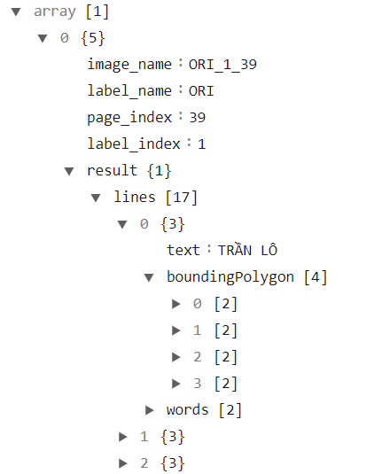

# Hướng dẫn nhanh
- Dùng `pdf_to_png.py`.
- Dùng `label_GUI.py`. (Xem `label_GUI_guide.md`)
- Tải thư viện `fuzzywuzzy` nếu muốn dùng hàm có sẵn trong `language_helper.py`
- OCR theo label.
- Chuyển kết quả OCR được thành file json có dạng như `demo.json`.

- Xem ví dụ OCR và xuất file output.json trong `demo_azure_ocr.ipynb`
- Load và sử dụng như trong video demo (`Demo_align_GUI.mp4`)
- Cẩn thận khi làm việc, nên sao lưu vào một file mới lúc làm được một khối lượng công việc nhất định.

# Hướng dẫn tùy chỉnh
- Tùy chỉnh các hàm tại `language_helper.py`
- Tùy chỉnh các cách lọc văn bản tại `simple_filter.py`. Data đầu vào của các hàm mẫu trong `simple_filter.py` là mảng có cấu trúc như 
- Tùy chỉnh tại hàm `populate_table` trong file `align_GUI.py`.
```python
full_table = []
# Iterate through label data and collect relevant text
for col, data in enumerate(label_datas): # TÙY CHỈNH TẠI ĐÂY
```
- Code mẫu chỉ bao gồm text Hán và phần phiên âm.
